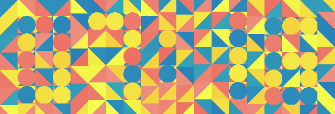

# clockcaptcha
Digital clock captcha



```shell
pip install clockcaptcha
```

### Usage

```python
from clockcaptcha import ClockCaptcha

captcha = ClockCaptcha()
print(captcha.values)

captcha.verify('0645') # False
captcha.save_image('image.png')

```
Choose between `color_mode='rgb'` ([color-captcha.png](color-captcha.png)) 
or `'grayscale'` ([grayscale-captcha.png](grayscale-captcha.png)). Pick a 12-hour or a 24-hour `clock_mode`.

Image size can be changed with relative `size` parameter. Here are corresponding pixel sizes. 

| size  | width   | height  |
|-------|---------|---------|
| 1     | 190     | 65      |
| 2     | 380     | 130     |
| **3** | **570** | **195** |
| 4 | 760 | 260 |
| ... | ... | ... | 

Change colors globally:
```python
from clockcaptcha import ClockCaptcha
ClockCaptcha.set_colors([
    '#fff',
    '#000'
])
```

